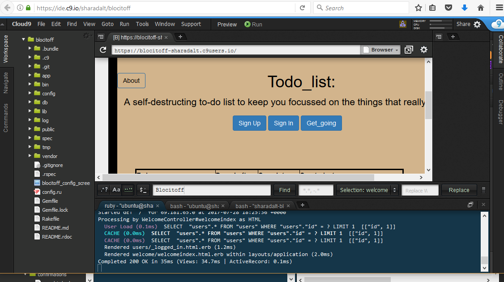

<h1>Todo_list</h1>

The application Todo_list, allows users to create self-destructing to-do lists.

To-do lists are lists of items you want to remember, but are not very important and thus 
get consistently put off. To address the problem of to-do list clutter, we create Todo_list.

Todo_list will aim to keep to-do lists manageable by automatically deleting to-do items 
that have not been completed after seven days. 

<h2>Use Case </h2>
 For the use case, goto the link, https://sharadalt.github.io/portfolio/blokitoff

<h2>Configuration</h2>

    

 

<h2>How to run it </h2>

To start the application you run it like any other rails application with the command, first start the rails server
 $ rails s and goto the localhost:3000, to make sure the app is running locally.
 
 On Cloud9 running rails is as below: 
 
 $ rails s -p $PORT -b $IP
 
 And to make sure the app is running, click on preview tab and select 'Preview Running application'.
 
 
