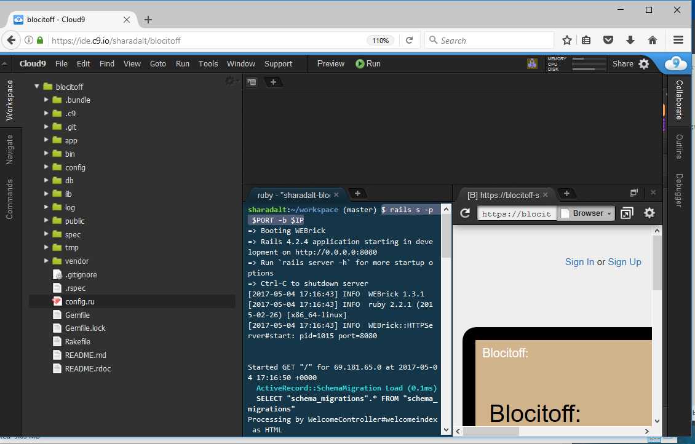

<h2>Blocitoff</h2>

The application blocitoff, allows users to create self-destructing to-do lists.

To-do lists are lists of items you want to remember, but are not very important and thus 
get consistently put off. To address the problem of to-do list clutter, we create Blocitoff.

Blocitoff will aim to keep to-do lists manageable by automatically deleting to-do items 
that have not been completed after seven days. 

<h3>Use Case </h3>
 For the use case, goto the link, https://sharadalt.github.io/portfolio/blokitoff

<h3>Configuration</h3>

    

 

<h3>How to run it </h3>

To start the application you run it like any other rails application with the command, first start the rails server
 $ rails s and goto the localhost:3000, to make sure the app is running locally.
 
 On Cloud9 running rails is as below: 
 
 $ rails s -p $PORT -b $IP
 
 
